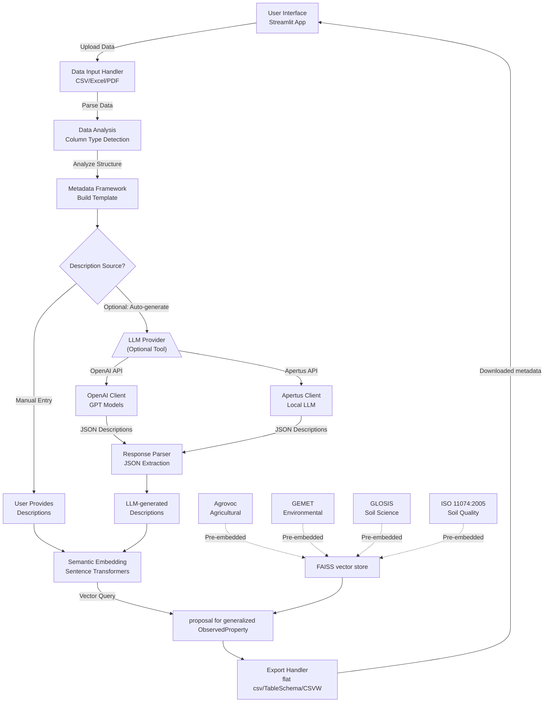

# DataAnnotator - Design Document

## 1. Overview

**DataAnnotator** is a Streamlit-based web application designed to help users create semantic metadata for tabular datasets. It combines optional Large Language Model (LLM) assistance with semantic embeddings to annotate data columns with machine-readable descriptions, element definitions, units, methods, and vocabulary mappings.

### Purpose
The tool addresses the metadata annotation workflow by:
1. **Enabling manual annotation**: Users directly enter descriptions for data columns
2. **Automating description generation** (optional): If users have context documentation, LLMs can help extract and structure descriptions automatically
3. **Linking to vocabularies**: Semantic embeddings match descriptions to controlled vocabularies for standardization

The LLM layer is optional—users can skip automated generation and manually provide descriptions, which the system will then semantically match to existing vocabulary terms.

---

## 2. System Architecture




## 3. Key Components

### 3.1 Data Input Module
- **Supported Formats - Tabular Data**: CSV, Excel (XLSX)
- **Supported Formats - Context Documents**: Free-form text input, PDF documents, DOCX files
- **Processing Functions**:
  - `read_csv_with_sniffer()`: Auto-detects CSV delimiters
  - `import_metadata_from_file()`: Reads existing metadata if provided
  - `read_context_file()`: Extracts context from PDFs/DOCX for LLM-assisted annotation

### 3.2 Data Analysis & Type Detection
- **Function**: `detect_column_type_from_series()`
- **Detects**:
  - **String**: Text data
  - **Numeric**: Integers and floats
  - **Date**: Temporal values
- **Approach**: Statistical sampling of column values (up to 200 non-null entries)

### 3.3 Metadata Framework
- **Function**: `build_metadata_df_from_df()`
- **Template Fields**:
  - `name`: Column identifier
  - `datatype`: Type classification (string/numeric/date)
  - `element`: Semantic element definition
  - `unit`: Measurement unit
  - `method`: Collection/calculation method
  - `description`: Human-readable description
  - `element_uri`: Link to external vocabulary

### 3.4 LLM Integration Layer (Optional)

**Purpose**: Automate the extraction and structuring of descriptions from existing documentation when users have context materials.

#### When to Use:
- User has documentation (PDFs, Word docs, etc.) describing variables
- Manual annotation is time-consuming for large datasets
- Descriptions need to be extracted from unstructured text

#### Supported Providers:
1. **OpenAI (Recommended)**
   - Uses GPT models for high-quality response generation
   - `get_response_OpenAI()`: Direct API calls
   - Best for complex, domain-specific text extraction

2. **Apertus (Alternative)**
   - Self-hosted LLM option
   - `get_response_Apertus()`: HTTP-based endpoint
   - Swiss-based open-source model

#### Functionality:
- **Function**: `generate_descriptions_with_LLM()`
- **Inputs**:
  - Variable names to describe
  - Context information from documents or text input
- **Output Format**: Structured JSON with descriptions for each variable

### 3.5 Semantic Embedding & Vocabulary Matching

- **Model**: Sentence Transformers (default: `all-MiniLM-L6-v2`)
- **Functions**:
  - `load_sentence_model()`: Load embedding model
  - `load_vocab_indexes()`: Load pre-computed FAISS indexes
  - `embed_vocab()`: Generate embeddings with optional definition weighting
- **Purpose**: Match generated or manually-entered descriptions to controlled vocabularies

#### Pre-computed Vocabulary Sources

The FAISS vectorstore was pre-computed by embedding terms from four major public vocabularies:

| Vocabulary | Domain | Source |
|-----------|--------|--------|
| **Agrovoc** | Agricultural and food sciences | FAO - Food and Agriculture Organization |
| **GEMET** | Environmental terminology | European Environment Agency (EEA) |
| **GLOSIS** | Soil science and properties | FAO Global Soil Information System |
| **ISO 11074:2005** | Soil quality terminology | International Organization for Standardization |

This multi-vocabulary approach enables annotation of diverse datasets including agricultural, environmental, and soil-related data.

#### FAISS Index Structure:
```
Index File: vocabCombined-{modelname}.index
Metadata File: vocabCombined-{modelname}-meta.npz

Metadata Dictionary Format:
{
    index_id: {
        "uri": "vocabulary_uri",
        "label": "preferred_label",
        "definition": "term_definition",
        "QC_label": "prefLabel|altLabel"
    },
    ...
}
```

### 3.6 Export & Download Module
- **Function**: `download_bytes()`
- **Supported Formats**:
  - Excel (XLSX) - for human review
  - JSON - for machine processing
  - CSV - for spreadsheet tools
- **Implementation**: Streamlit session-based download management


## 4. Data Flow

### 4.1 Standard Annotation Workflow

```
1. User Uploads Data (CSV/Excel)
   ↓
2. System Auto-detects Column Types
   ↓
3. Generate Metadata Template
   ↓
4. ┌─ PATH A: Manual Annotation ──────────┐
   │ User enters descriptions manually    │
   │ or is present in the uploaded        │
   │ metadata file                        |
   └──────────────────────────────────────┘
      OR
   ┌─ PATH B: LLM-Assisted (Optional) ────┐
   │ 4a. Load Context Documents (PDF/DOCX)│
   │ 4b. Send to LLM Provider             │
   │     ├→ Check Cache First             │
   │     └→ Call API if Not Cached        │
   │ 4c. Parse LLM Response (JSON extract)│
   └──────────────────────────────────────┘
   ↓
5. Descriptions Ready (manual or LLM-generated)
   ↓
6. Generate Semantic Embeddings
   ↓
7. Match Against Vocabulary Index
   ↓
8. Enrich Metadata with Vocabulary URIs
   ↓
9. Export Results in different metadata formats
```

**Key Point**: The LLM layer is a *helper tool*, not a requirement. Users can skip it entirely and manually provide descriptions for semantic embedding and vocabulary matching.

### 4.2 Metadata Update Strategy
- **Function**: `apply_new_metadata_info()`
- **Modes**:
  - `no_overwrite`: Preserve existing annotations
  - `overwrite`: Replace with new values
- **Use Case**: Iterative refinement of metadata


## 5. Key Features

| Feature | Implementation | Purpose |
|---------|----------------|---------|
| **Auto Type Detection** | Statistical sampling | Identify data patterns |
| **Manual Description Entry** | Streamlit text inputs | Direct user annotation |
| **Optional LLM Assistance** | OpenAI/Apertus integration | Auto-extract descriptions from docs |
| **Semantic Vocabulary Matching** | FAISS vector search | Link descriptions to standard vocabularies |
| **Context Awareness** | PDF/DOCX import + prompting | Extract domain-specific info when available |
| **Multi-format Export** | Excel/JSON/CSV output | Integration with downstream tools |


## 6. Technical Stack

```plaintext
Frontend:        Streamlit 1.51+
Backend Logic:   Python 3.12+
LLM Integration: OpenAI API, Apertus HTTP
Embeddings:      Sentence Transformers 5.1+
Vector Search:   FAISS (CPU) 1.12+
File Parsing:    PyPDF2, python-docx, openpyxl
ML Libraries:    scikit-learn, NumPy
```


## 7. Dependencies & Models

### Python Packages
- `streamlit>=1.51.0` - Web UI framework
- `openai>=2.7.2` - LLM API client
- `sentence-transformers>=5.1.2` - Semantic embedding
- `faiss-cpu>=1.12.0` - Vector similarity search
- `pandas>=2.0` - Data manipulation
- `openpyxl>=3.1.5` - Excel handling
- `python-docx>=1.2.0` - Word document parsing
- `pypdf2>=3.0.1` - PDF text extraction

### Pre-trained Models/Data
- **Embedding Model**: `all-MiniLM-L6-v2` (384 dimensions, 22M parameters)
- **FAISS Index**: Pre-computed vocabulary embeddings (stored in `data/` directory)

---

## 8. Configuration & Extensibility

### Environment Variables
- `OPENAI_API_KEY`: API credentials for OpenAI
- `APERTUS_API_KEY`: API credentials for Apertus (optional)

### Customization Points
- **Embedding Model**: Configurable via `load_sentence_model(modelname)`
- **LLM Provider**: Toggle between OpenAI and Apertus
- **System Prompt**: Modify instructions in `generate_descriptions_with_LLM()`
- **Vocabulary Index**: Replace FAISS index files for different domains


## 9. Performance Considerations

### Optimization Strategies
1. **Model Caching**: Streamlit `@st.cache_resource` for persistent model loading
2. **API Caching**: JSON-based result memoization to avoid redundant API calls
3. **FAISS Optimization**: Pre-computed indexes for O(log n) vector search
4. **Batch Processing**: Process multiple columns in single LLM call

